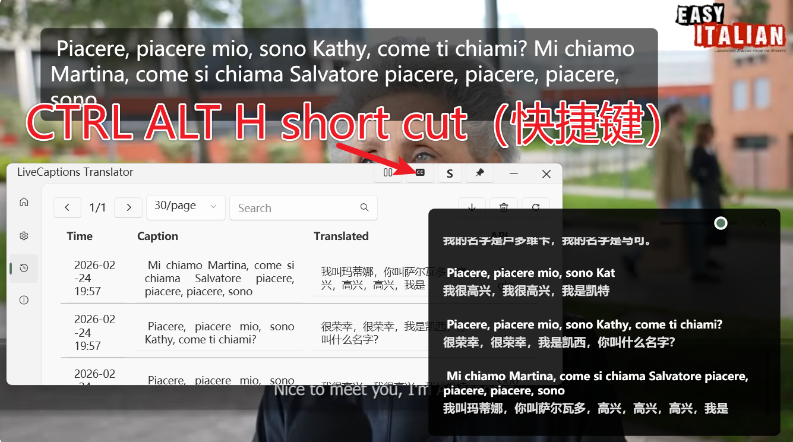
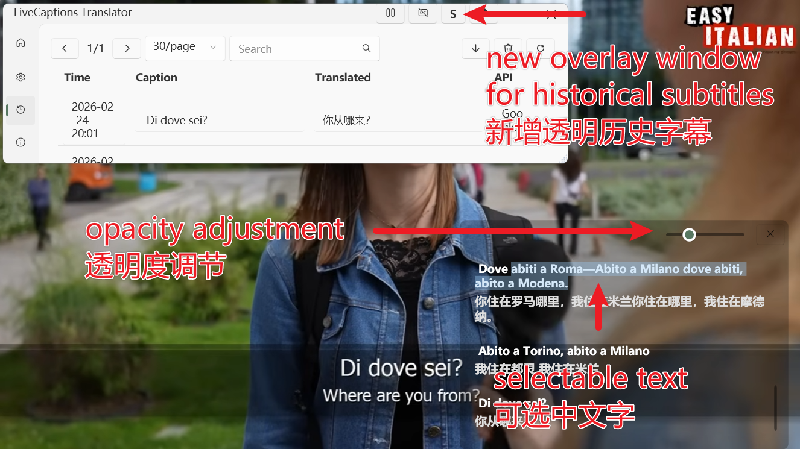

# LiveCaptions Translator (Fork Edition)

本项目是基于 [SakiRinn/LiveCaptions-Translator](https://github.com/SakiRinn/LiveCaptions-Translator) 开发的增强版本。

原项目结合 Windows LiveCaptions 与翻译 API 实现了高精度的实时语音翻译。本分支在此基础上，针对交互控制与历史回顾体验进行了深度定制。

---

## ✨ 新增核心特性 (New Features)

### ⌨️ 全局快捷键与增强控制栏
为了提升操作效率，本版本引入了更便捷的控制交互。

* **CTRL + ALT + H 快捷键：** 支持通过全局快捷键快速触发核心功能或切换显示状态，无需频繁操作主程序界面。
* **控制状态集成：** 在主界面上方新增了功能状态按钮（如 CC 状态切换），让当前工作模式一目了然。

  
   
  <em style="font-size:80%">快捷键控制功能展示</em>
   

---

### 📜 交互式透明历史窗口
这是本次更新的核心功能，专门用于解决翻译字幕“转瞬即逝”的问题。

* **透明度实时调节 (Opacity Adjustment)：** 窗口配备了滑动条，用户可根据视频、直播或游戏画面的明暗，自由调节字幕窗的透明度，实现完美的视觉融合。
* **文字可选中复制 (Selectable Text)：** 历史窗口中的中外文内容均支持鼠标直接选中。这极大地方便了用户随时拷贝关键术语、查询生词或记录会议重点。
* **历史沉浸体验：** 独立的透明悬浮设计，让您在无需干扰当前操作的情况下，随时回溯之前的对话内容。

  
   
  <em style="font-size:80%">透明度调节与文字选中功能演示</em>
   

---

## 🛠️ 环境要求
本版本继承了原项目的基本运行需求：
* **系统版本：** Windows 11 (22H2+)。
* **运行时：** 建议安装 .NET 8.0 或更高版本。